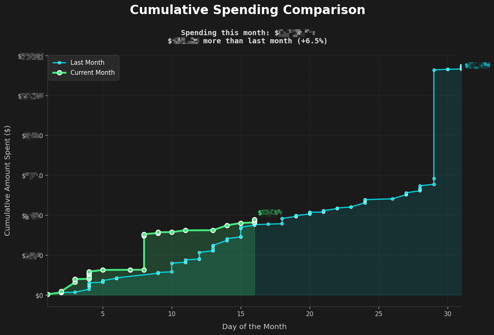

## Introduction
Due to Mint.com closing, I transitioned to Lunchmoney.app for tracking my spending and managing budgets. One feature I missed from Mint was seeing *how I was tracking compared to the previous month*. As Lunchmoney has a shared [API](lunchmoney.dev), I built this dashboard around that comparison.

## The dashboard

A dark, dense, keyboard-driven spending dashboard: month-to-date pace, budget tracking and cash-flow history, built around **"where was I at this point last month?"**

```bash
npm install
npm run dev      # Vite on :5173, API proxy on :3001
npm run build    # → dist/
npm start        # production: serves dist/ + API on :3001
```

**Highlights**

* **Benchmark-first overview** — spend to date, the same period last month, the month-end projection and net worth, each with an inline sparkline and a delta chip.
* **Pace chart** — cumulative this month against a day-normalised last month, with the region between the two curves shaded (that gap *is* the month-over-month story), a "today" rule, an even-pace benchmark and the projection.
* **Budget** — every line item with a meter marking where an even pace would put you today, spend to date, the same line a month ago, and what is left. Over-budget rows are flagged.
* **Categories** — sortable month-over-month table with dual comparison bars, a "biggest movers" summary and a movers-only filter.
* **Spend calendar** — a GitHub-style contribution grid: rows are weekdays, columns are weeks, and each square's shade is a quantile of *your* daily spending. Hover any day for its total and transaction count.
* **Trend** — up to 36 months of spend vs earn, with month-over-month percentages drawn above each bar and a 3-month trailing average.
* **Net worth** — exact current balances, history reconstructed from monthly cash flow, breakdown by account type.
* **Command palette** (Cmd/Ctrl+K), keyboard navigation (`1`–`8`, `r`, `t`, `f`, `/`), a comparison-basis switch (same period vs. full month), and shareable URLs (`?date=2026-06-15`, `?theme=light`).

**Performance**

The dashboard renders in two phases. Phase one fetches only the month you're looking at (plus the month before) and paints the KPIs, pace, budget, categories and transactions in well under a second. Phase two pulls the deep history that feeds the trend, calendar and net-worth charts; it is anchored on *today*, so its URL never changes as you step through months and it is a cache hit after the first visit.

Beyond that: the proxy paginates and caches responses server-side (deep history goes from ~3.6 s cold to ~30 ms warm), the browser caches in memory and `sessionStorage` (20 min TTL, LRU), charts are created lazily as their section nears the viewport, and the transactions table renders in pages.

**A note on the Lunchmoney API**

`GET /v1/transactions` defaults to a 1000-row page and **silently truncates** longer ranges — a 12-month request came back with only the newest 1000 transactions, quietly mangling the oldest months of the trend and net worth (in testing, a month showed a rounding error's worth of spending instead of its real total). The proxy now walks the pages, projects out the ~20 response fields the dashboard doesn't use (≈8× smaller payloads), caches them, and backs off on the 100-request rate limit. See `server.js`.

### Testing

`npm run test:ui` boots the real bundle in jsdom against a running proxy and exercises rendering, sorting, filtering, month stepping, the palette, keyboard shortcuts and the custom canvas plugins (38 assertions). Requires `npm run dev` to be running.

### Architecture

```
index.html          app shell: rail, topbar, status strip, sections, palette
src/style.css       design system — dark-first tokens, light override
src/lib/api.js      cached fetch layer over the Express proxy
src/lib/compute.js  all analytics: pacing, MoM, budget model, net worth
src/lib/charts.js   Chart.js factories, lazy registry, custom canvas plugins
src/lib/format.js   money / percent formatting with semantic tone
src/ui/state.js     tiny observable store driving panel re-renders
src/ui/dom.js       DOM helpers, sparklines, one shared rAF ticker
src/ui/palette.js   command palette
src/ui/panels/*     one module per section (overview, pace, budget, calendar,
                      categories, trend, networth, transactions)
server.js           Express proxy to the Lunchmoney API (LM_API_KEY / LM_HOSTNAME)
```

### Set-up
Create a file called `.env` in the root folder of this project. The variables included should be:
```
LM_API_KEY="xyzxyzxyzxyzxyzxyzxyzxyzxyzxyzxyz"
LM_HOSTNAME="https://dev.lunchmoney.app"
```
You can get an API key [from lunchmoney](https://my.lunchmoney.app/developers).

#### Installing dependencies

This project uses [uv](https://docs.astral.sh/uv/) for dependency management. To install dependencies:

```bash
uv sync
```

To also install development dependencies:

```bash
uv sync --group dev
```

#### Running the code
You can run the code using:
```bash
uv run python comparison.py
```

The script also accepts an optional date argument to specify the reference date for the comparison. If omitted, it defaults to the current date.

*   `--date` or `-d`: Specify a date in YYYY-MM-DD format.

Example:
```bash
uv run python comparison.py --date 2023-11-15
```

Alternatively, you can activate the virtual environment first and run normally:
```bash
source .venv/bin/activate
python comparison.py
```

This will generate a comparison as of November 15, 2023, comparing spending up to that day against the equivalent period in October 2023.

## How it Works

### Dashboard

The dashboard fetches transactions for the current month (month-to-date), the full previous month, and a rolling 36-month window (`HISTORY_MONTHS` in `src/lib/util.js`) for the trend, calendar and net-worth history, then derives everything in `src/lib/compute.js`.

The reference day in the previous month is chosen proportionally — day 15 of a 30-day month maps to day 16 of a 31-day month — so the comparison is always like-for-like. That single `equivalentDay` value drives the KPI benchmark, the category deltas, the budget comparison and the day-normalised pace curve.

The benchmark KPI is deliberately explicit about whose number it is showing: the large figure is labelled *spent last month · same period*, badged with the exact date (`by Jun 16`), and a block underneath spells out `you spent $1,234.56` → `that is less by $987.65 (−44.4%)`.

Correctness notes:

* Amounts are aggregated from `to_base` (falling back to `amount`) so multi-currency accounts stay comparable, and spend is taken as an absolute value so the API's sign convention for income does not matter.
* Budget spend-to-date is computed from those same transactions rather than the API's `spending_to_base`, which reports the whole month for any month already in the past. One source of truth means the budget meter always agrees with the headline numbers.
* The month-end projection is a plain run-rate. (`actual + budget remaining` is deliberately *not* used — it always collapses to the budget total and tells you nothing.) The budget is shown separately as the target the projection is measured against.

### Script

`comparison.py` remains the standalone script. It fetches your transactions for two periods:
1.  The "current" period: This starts from the first day of the month of the reference date (either the date provided via `--date` or today's date if no argument is given) and includes all transactions up to and including the reference date.
2.  The "previous" period: This covers the entire month immediately preceding the reference date's month.

It then calculates cumulative spending for both periods and plots them. The comparison text ("X more/less than last month") is determined by comparing the total spending up to the reference day in the "current" period against a proportionally equivalent day in the "previous" period.

## Result
The final graph provides a visual comparison of cumulative spending. An example is shown below (note: your specific output will vary).



**Note on the plot:**
*   The solid green line shows your spending in the current reference month up to the specified (or current) date.
*   The dashed blue line shows your spending throughout the entire previous month.
*   A dotted green line may also appear, showing "Projected Spending" for the remainder of the current reference month. This projection is based on transactions already made within that month that occur after the reference date.

**Potential Improvements:**
* [ ] Further refinement of x-axis alignment and labeling for clarity, especially when comparing months of different lengths.
